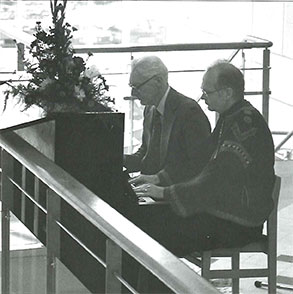
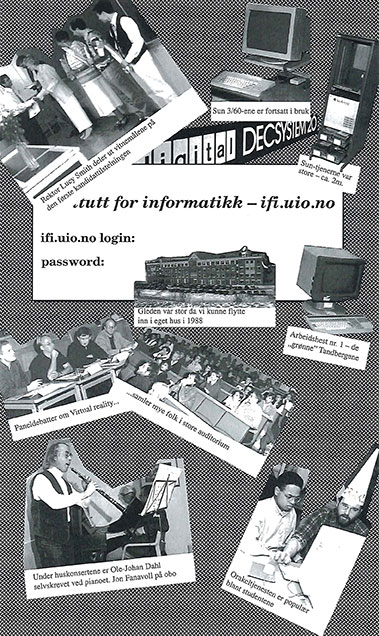
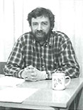
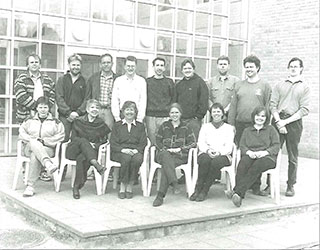

<figure>
  
  <figcaption>Bilde brukt på forsiden av heftet, med bilde av Ole-Johan Dahl og Donald Knuth som spiller sammen på piano.</figcaption>
</figure>

* [Datahistorien ved Universitetet i Oslo - Institutt for informatikk 1977 - 1997](./Datahistorien ved Universitetet i Oslo - Institutt for informatikk 1977 - 1997.pdf)
  * Originalt utgitt og produsert av IFI, Institutt for informatikk
  * Redaksjon og layout: Aud Veen Noodt
  * Produksjon og foto: Øystein Christiansen
  * Trykk: Oslo Forlagstrykkeri
  * Opplag: 1500
  * Kopiert til nettside av [Arne Hassel](../../person/arnehass), da den ikke ligger tilgjengelig på nett i tekst-søkbart format

<figure>
  
  <figcaption>Kollasj fra heftet, med diverse bilder fra Institutt for informatikk sin historie.</figcaption>
</figure>

## Forord

<figure>
  
  <figcaption>Bilde av Knut Liestøl</figcaption>
</figure>

Da Institutt for informatikk ble dannet for tyve år siden var det et tegn på at faget begynte å bli akseptert. Alle mente nok ikke at informatikk var et ordentlig "akademisk" fag, men dets viktige rolle i utdanningssystemet ble godtatt. Det var da også vanskelig å unngå å legge merke til instituttets studenter. I de første budsjettdokumentene medførte deres antall at situasjonen ble beskrevet som "permanent kritisk". I dag, 20 år senere, uttaler næringslivets organisasjoner at "situasjonen er prekær" på grunn av for få IT-kandidater. Disse uttalelsene kunne gi opphav til mange gode titler på dette heftet, slik som "Fra krise til krise" eller "Alltid ettertraktet". Disse tittelmessige ytterpunktene gir selvfølgelig ikke et dekkende bilde. At de med en viss rett kunne brukes, illustrerer imidlertid at instituttet har vært del av en utvikling det er vel verdt å belyse. Denne beretningen er laget for å bidra til vår kollektive hukommelse på dette punkt.

Dette er imidlertid ikke noe forsøk på å skrive den objektive historien om IFI. Det er "veteranenes" beretninger om instituttet og om sin egen faglige tilværelse som beskrives her. Vi mener det er viktig å få dette nedfelt nå. Veteranene ser riktignok friske ut, og de vil nok huske historien en god tid ennå, men de færreste vil likevel huske bedre om 5-10 år.

Sammen med den tidligere utgitte "Datahistorien ved Universitetet i Oslo - Fra begynnelsen til ut i syttiårene" (USIT, juni-96), gir beretningene viktige bilder av utviklingen fra den spede begynnelse til i dag. Det er som nevnt beskrivelser fra innsiden av miljøet, og vi er klar over at våre naboer på universitetet til tider kan ha opplevd oss annerledes. Instituttets "forgjenger" ved Matematisk institutt ble betegnet med "Gjøkungen" for å illustrere hvordan naboskapet kunne føles. Andre får uttale seg om instituttet har hatt en tilsvarende status. Jeg vil uansett benytte anledningen til å takke våre fysiske og organisasjonsmessige naboer for tolerant behandling.

For å få fremstilt beretninger krever ikke bare noen som forteller, men også noen som lytter, skriver ned og redigerer. Dette heftet er et resultat av Aud Veen Noodts entusiastiske og aktive innsats. Instituttet vil takke henne varmt, og håper at mange vil ha glede av denne samlingen med beretninger fra et institutt som ihvertfall vi selv har opplevd som alt annet enn kjedelig.

<strong>Knut Liestøl</strong>

<figure>
  
  <figcaption>
    
Ifi har 9 terminalstuer for studenter; 6 for hovedfag og 3 for laveregrad. Terminalstuene for hovedfag er relativt små med ca. 10 arbeidsplasser på hver stue. Laveregradstuene er en del større, Abel har 100 arbeidsplasser, Ifi (bildet) har 50 plasser og VB har 20.

    
Alle terminalstuene er utstyrt med UNIX arbeidsplassmaskiner og X-terminaler som er koblet opp til kraftige UNIX-servere i Ifis maskinrom.

    
Terminalstuene for laveregrad er betjent av terminalvakter. Dette er studenter som er betalt for å hjelpe de andre studentene ved å svare på spørsmål og hjelpe de med problemer de måtte ha med maskinene.

    
Foto: Øystein Christiansen

  </figcaption>
</figure>

<figure>
  
  <figcaption>
    
Slik kan studenttilværelsen også arte seg. Bildet ble tatt på taket av informatikkbygget den dagen i 1988 da den offisielle åpningen fant sted. Vi ser fra venstre: Sing-Rod Guttormsen, Frode Sti, Sølvi Andersen, (delvis skjult) Kristin Braa, Anders Kluge og Ulle Nævdal.

    
Foto: Øystein Christiansen

  </figcaption>
</figure>

## Organisering 1960 - 1977 Stillinger

### Databehandling og Numerisk analyse

Det Elektroniske Regneanlegg Wegematic 1000 ble åpnet i 1960. Hele den vitenskapelige staben den gang var lederen, Ole Amble, med to vitenskapelige assistenter. Regneanlegget var organisert direkte under fakultetet. I 1963 fikk regneanlegget en amanuensisstilling som Per Ofstad ble tilsatt i.

Avdeling for Numerisk analyse, Avdeling D, Matematisk institutt ble opprettet i 1964 og var en omorganisering av det tidligere regneanlegget. Avdelingen ble tillagt to oppgaver - undervisning og drift av regneanlegget. Amble ledet avdelingen de to første årene. Per Ofstad tok over denne funksjonen i 1966 og var datasjef til 1970. Dag Belsnes ble tilsatt i amanuensisstillingen i 1967.

<blockquote>
Ole-Johan Dahl ble universitetets første dataprofessor i 1968. Han ble bedt om å søke og var formelt professor i numerisk analyse og faglig leder av den vitenskapelige delen av arbeidet på avdeling D, Matematisk institutt. I praksis var han allerede da professor i informatikk og av uvurderlig betydning for at utdanningen av hovedfagskandidater nå virkelig fikk vind i seilene.
<footer>Per Ofstad</footer></blockquote>

Til avdelingen var det også knyttet et lektorat so Throstein Lunde Johnsen hadde frem til 1970. Han ble ettefulgt av Olav Dahl. Arne Jonassen ble samtidig tilsatt i et nytt lektorat. Ole Amble kom tilbake 1971, etter fem år som dosent ved NTH i Trondheim. Avdelingen fikk i tiden videre fire stillinger til undervisning og to stillinger knyttet til regneanlegget. Ansatte på regneanlegget foreleste også i databehandling og ga hovedfags-veiledning gjennom seksi- og syttiårene.

I 1972 skiftet avdeling D navn - til avdeling for Databehandling og Numerisk analyse. Samtidig ble EDB-senteret skilt ut som en egen enhet og lagt direkte under universitetets administrasjon. Det samlede vitenskapelige personalet på avdeling D, Matematisk institutt var i 1973 (data fra "Gjøkungen") - en professor, en professor II, en dosent, en amanuensis, tre lektorer og to vitenskapelige assistenter.

<strong>Fra "Datahistorien ved Universitetet i Oslo", USIT juni 1996.</strong>

Følgende vitenskapelige personale fulgte med fra avdeling D, Matematisk institutt: Ole-Johan Dahl, Sverre Spurkland, Ole Amble, Tom Lyche, Arne Jonassen, Olav Dahl, Arne Wang og Oddvar Hesjedal.

### Kybernetikk

Våren 1967 tilbød Fysisk institutt en ny linje, linjen for kybernetikk. Undervisningen i disse fagene var basert på innleide lærekrefter, og kursene utgjorde tilsammen et tilbud på 1. avdeling. Studenter som valgte dette studiet møtte problemer når de ville begynne hovedfag. For at et fag eller en lunje skal kunne tilby hovedfag må det være minst et dosentur innen faget, dette var ikke tilfelle for kybernetikk. Det var heller noe undervisningstilbud på hovedfagsnivå i kybernetikk.

Tore Olsen, instituttbestyrer ved Fysisk institutt, utarbeidet et budsjettforslag for linjen i kybernetikk høsten 1968. Forslaget innebar å opprette en professor II og et lektorat i kybernetikk. Fysisk institutt søkte også å opprette et dosentur. I sin innstilling til budsjett for 1969 foreslo Universitetet et dosentur til Fysisk institutt, en professor II-stilling og et lektorat tiltenkt linjen for kybernetikk.

Da det ble klart at Fysisk institutt ikke ville bli tildelt noen nye stillinger i 1969, begynte frustrasjonen å bre seg blant studentene. Kybernetikkutvalget ble opprettet på initiativ fra studentene den 9. oktober 1968.

Kybernetikkutvalget innså at det var vanskelig for Fysisk institutt å gjøre noe, men at studentene kunne ha en viss mulighet hvis de tok i bruk lobbyvirksomhet Studentene tok da skjeen i sin egen hånd og utarbeidet et saksdokument med sterke og gode begrunnelser for hvor viktig dosenturet var for forskningsmiljøet og næringslivet i Norge. Dette dokumentet var undertegnet av en rekke aktive studenter, deriblant Rolf Lind, Jørn Archer og Emil Hasle. Dette skrivet ble så produsert i like mange eksemplarer som det var medlemmer i Kirke- og undervisnings-komitéen. Som ekte lobbyister dro en av dem (Rolf Lind) til Stortinget i forkant av ett av komitéens møter. Saken ble så lagt frem på møtet, og dosenturet var vunnet tilbake!

Lars Walløe ble ansatt som den første dosent i kybernetikk ved Universitetet i Oslo i 1970.

<strong>Fra "Cybernetisk Selskab 25 år", 1969 - 1994</strong>

Linjen fikk to lektorstillinger og en professor II i tiden frem til IFI ble opprettet. Følgende vitenskapelige personale fulgte med fra Fysisk institutt: Lars Walløe, Trygve Reenskaug, Rolf Bjerknes og Ellen Hisdal. 

### Institutt for informatikk

Ble opprettet 1. januar 1977.

#### Grunnutdanning ved IFI 1977:

* IN0: Grunnkurs i bruk av datamaskiner
* IN1: Innføring i databehandling
* IN2: Programmeringslaboratorium
* IN3: Numeriske metoder
* IN10: Algoritmer og datastrukturer
* IN11: Filbehandling
* IN12: Programmeringsspråk
* IN13: Automatateori
* IN20: Numerisk lineæralgebra
* IN21: Numerisk analyse
* IN30: Lineær optimering
* IN31: Ikke-lineær optimering
* IN40: Datamaskinlogikk og maskinspråk
* IN41: Datamaskinteknikk
* IN42: Operativsystemer
* IN50: Lineær kontrollteori
* IN51: Statistisk signalteori
* IN52: Informasjonsteori
* IN53: Digital simulering
* IN54: Videregående kontrollteori
* IN60: Samfunnsmessige aspekter ved bruk av datamaskiner

## Administrasjon og organisering

Instituttet er i jubileumsåret et av de store ved fakultetet.

Instituttet tilbyr studieretningene:

* Matematisk modellering
* Databehandling
* Digitalteknikk
* Systemarbeid

### Forhistorien

Rundt 1979 ble det en voldsom vekst i studenttilstrømmingen til datafag og behovet for databehandling til forskning. Det ble nedsatt to komitéer for å utrede behov og finne den videre organiseringen av faget informatikk som var begynt å ta form. Arne Jonassen var den gang bestyrer på Avdeling D, Numerisk analyse, ved Matematisk institutt og sekretær for begge komitéene. Han ledet også arbeidet med "Gjøkungen".

<blockquote>
  
Den første store oppgaven var en innstilling fra komitéen som var opprettet for å vurdere universitetets EDB-behov i de nærmeste fem år. Innstillingen kom i mai 1971, og komitéen var ledet av Ole-Johan Dahl. Medlemmee var: Herdis Thorén Amundsen, Tor Brattvåg, Jon Kongsrud, Arild Jansen, Rolf Nordhagen og Hans M. Seip.

  
Tre år senere laget vi utredningen Gjøkungen internt på avdeling D. Dette var en utredning om databehandlingsfagets og avdelingens egen situasjon ved Universitetet i Oslo. Alle avdelingens ansatte deltok i arbeidet sammen med to av studentene. Hvorfor Gjøkungen? Det var mitt forslag til navn og et bilde på den situasjonen vi følte oss i. På den ene siden var etterspørselen etter kurs fra studentene langt i overkant av hva vi hadde kapasitet til å tilby. På den annen side var vi redde for å bli en gjøkunge på Matematisk institutt og spise resten av instituttet ut av redet. Vi ble tatt svært alvorlig på universitetet da utredningen ble lagt frem i mars 1974.

  
Like etter at Gjøkungen forelå, oppnevnte fakultetet en ny komité som skulle se på fagets organisering og behov for ressurser. Resultatet ble et helt nytt Institutt for informatikk som ble opprettet 1977. Der slo man sammen avdeling D fra Matematisk institutt og deler av kybernetikk fra Fysisk institutt. Dette var en naturlig sammenslåing, men hadde vel ikke annen faglig begrunnelse enn av de representerte miljøer som det kunne bygges videre på faglig. Kybernetikk hadde et driftig miljø under ledelse av Lars Walløe. Informatikkkomitéen var ledet av Nico Norman. Medlemmene var: Per S. Enger, Oddvar Hesjedal, Arne Kjekshus, Arnfinn Laudal, Rolf Nordhagen, Trygve Reenskaug og Erik Aarnæs. Komitéen la frem en enstemmig innstilling 12. juni 1975.

  <footer>Arne Jonassen</footer>
</blockquote>

<blockquote>
  
Regneanlegget var også organisert under avdeling D fra 1964 til 1970, og hovedansvaret for dette tillagt bestyreren. Forventningene til en professor var sore den gangen jeg tiltrådte som professor i 1968. Jeg skulle dekke alle administrative funksjoner på avdelingen samtidig som jeg bygget databehandlingsfaget opp fra grunnen av. Det ble lange arbeidsdager. Da Arne Jonassen ble universitetslektor og tok over avdelingsbestyrerjobben i 1970, var det en god og stor avlastning.

  
Situasjonen i begynnelsen av syttiårene ble etter hvert vanskeli. Studentmassen vokste hurtig samtidig som regjeringen la et "lokk" over Oslo-området - ingen nye, statlige stillinger overhodet. Til slutt ble det med god hjelp av dekanus ved Det matematiske naturvitenskapelige fakultet, fysikkprofessor Tore Olsen, laget et opplegg for flere trinn som fikk litt hull på byllen. Ett av trinnene var dannelsen av nytt Institutt for informatikk.

  <footer>Ole-Johan Dahl</footer>
</blockquote>

<strong> Fra "Datahistorien ved Universitetet i Oslo", USIT juni 1996</strong>

### Faste stillinger

* Professor: 16
* Frofessor II: 11
* Mellomgruppestillinger: 21
* Administrasjon: 7
* Tekniske stillinger: 10

## Elisabeth Hurlen

Beth Hurlen er en institusjon. Blid og bestemt har hun holdt orden på det meste i hele IFIs historie.

Berh Hurlen tok hovedfag i kjemi ved UiO i 1955. De siste tyve årene har hun viet administrativt arbeid som leder av administrasjonen ved IFI.

Hun tar også med de siste årene frem til pensjonsalderen. Utrolig blir hun 70 år neste sommer.

Feiringen av 20 års jubileet ville hun ha sin sikre hånd over.

<figure>
  
  <figcaption>
    
Leder Beth Hurlen omgitt av det teknisk-administrative personalet ved IFI.

    
Bak, fra venstre: Narve Trædal, Ronny A. Nilsen, Øyvind Endresen, Trond Alvern, Nenad Ciric, Lars Håkedal, Øystein Christiansen, Jørn Hagerup, Lars H.B. Olafsen.

    
Foran fra venstre: Ingebjørg Theiss, Sara Selmark, Elisabeth Hurlen, Katinka Grønli, Inger Ann Faye, Kristin Skar.

    
Foto: Rolf Bjerknes

  </figcaption>
</figure>

<q>Beth var den første som ble ansatt ved IFI,</q> forteller Tom Lyche som var den første bestyreren. <q>Og det var et svært vellykket valg.</q>

<q>Den første tiden hadde vi kontorer i Matematikk-bygningen,</q> forteller Beth Hurlen. <q>Vi var marmorert inn i Matematisk institutt og hadde kontorer i flere etasjer og fullstendig innimellom matematikerne. Etter fire år i Niels Henrik Abels hus flyttet vi til Fysikkbygningen hvor IFI holdt til i åtte år. I 1988 skiltes vi som venner også fra fysikerne.</q>

<q>I ettertid har jeg tenkt en del på at vi var et flerkulturelt institutt da vi begynte, men det var aldri fremtredende som et problem. Jeg tror at alle ville at vi skulle lykkes og la inn sine bidrag for at det skulle gå bra. Dette var et felles mål, og alle hadde stor respekt for hverandre. VI har måttet kjempe sammen utad, og det skaper også samhold. Internt på instituttet har vi alltid hatt et godt miljø. Jeg kan faktisk ikke huske en eneste alvorlig konflikt, og jeg har hatt noen utrolig spennende og utfordrende år ved IFI.</q>

### Vekst

<q>I hele IFIs historie har vi vært i vekst, og hele tiden har vi hatt problemer med å få andre til å forstå at vi trengte mer ressurser,</q> sier Berh Hurlen. <q>Vi har måttet bruke svært mye tid og krefter på å utrede og dokumentere behovet for mer plass og flere stillinger. Spesielt de første årene kjempet vi mye i motvind. De fleste rundt oss trodde at vi ikke ville vokse videre da IFI ble etablert.</q>

<q>Heldigvis har vi alltid fått god støtte og hjelp av fakultetets ledelse. Det ble raskt utarbeidet et <em>Program for styrking av fagområdet informatikk</em>, som gikk i årene 1979 - 82. Først fikk vi midler over statsbudsjettet til å omgjøre tre vit. ass. stillinger til amanuensis. Deretter fikk vi stillinger ved intern omdisponering ved fakultetet. Siden har det dryppet ressurser over statsbudsjettet jevnt og trutt helt frem til i dag.</q>  

<q>Men det er forsatt behov for flere vitenskapelige stillinger. Antall studenter pr. lærer er også i dag uforsvarlig høyt. I inneværende semester er det på lavere grad påmeldt ca. 2500 studenter på forskjellige emner, og vi har 300 hovedfagsstudenter. Det sier seg selv at de ansatte får liten tid til forskning.</q>

### Administrasjon

<q>Selv ikke egne ressurser til administrasjon anså man som nødvendig i startfasen. Jeg ble først ansatt i halv stilling, mens kontorfullmektig Evy Madsen utgjorde resten av administrasjonen. Hun kom fra Matematisk institutt og ble senere med på IFIs flyttinger helt frem til hun gikk av med pensjon i 1993.</q>

<q>Dagens administrative stab er heller ikke stor. Jeg ønsker meg flere stillinger slik at vi kunne avlaste forskerne fra flere administrasjonsoppgaver. Det har også kommet mange nye oppgaver de siste årene.</q>

<q>Samarbeidet mellom meg og bestyrerne har vært meget godt og, fremfor alt, stabilt,</q> sier Beth Hurlen til slutt. <q>Jeg tror det er få andre institutter som bare har hatt fire bestyrere i løpet av tyve år.</q>

### Huset

Det er flere som gjerne vil være foreldre for Informatikk-bygningen i Gaustadalléen.

<q>Informatikkbygningen er min idé,</q> sier Arne Jonassen. <q>Jeg fikk det inn i budsjettet ved Norsk Regnesentral i 1980, da jeg var assisterende direktør for Drude Berntsen. Vi fikk behovet for nye lokaler til NR på dagsorden hos NTNF, og jeg misjonerte for en samlokalisering av informatikkmiljøene på Blindern både ved IFI og USIT. Men det var sannsynligvis noen flere aktører på banen parallelt, som sparket ballen opp i første divisjon, fordi det gikk så utrolig fort fra idéen ble lansert til det hele var igang. Allerede like etter at jeg kom tilbake til IFI i 1982, ble jeg valgt inn i byggekomitéen og deltok i arbeidet med å fordele plass og rom til institusjonene som skulle inn.</q>

<q>Det var jeg som tok den ballen videre,</q> sier Lars Walløe. <q>Jeg fikk rektor ved UiO, Bjarne Waaler, og direktøren ved NTNF, Gudmund Harlem, til å sette seg sammen med meg rundt bordet for å skape en samlet løsning. NTNF og UiO bidro med hver sin bit. NTNF hadde pengene og trengte plass til Norsk Regnesentral, men hadde ingen tomt. UiO hadde opsjon på tomten som opprinnelig var tenkt til et nytt universitetsbibliotek.</q>

<q>NTNF finansierte bygget, og universitetet forpliktet seg ved langsiktige leieavtaler. Derved hadde vi en økonomisk pakke som var tilfredstillende for alle parter. Dette var i den tiden hvor det ikke var mulig å få noen som helst midler til universitetsbygg i Oslo. Etter å ha vært fødselshjelper for bygget trakk jeg meg til side. Det var andre som var med i det praktiske gjennomføringsarbeidet, byggekomitéer o.l. Men jeg strevde med å selge idéen intern på IFI. Enkelte av de ansatte ville ikke over på den andre siden av trikkelinjen. Det var for langt unna Matematikkbygningen for noen. Det løste seg da vi fikk broen over til det øvre Blindernområdet med i byggeplanene.</q>

### Plassering

<q>Plassproblemene strevde jeg med allerede fra første øyeblikk jeg ble bestyrer,</q> sier Walløe. <q>Dette var en av de alle første utfordringene jeg møtte. Jeg følte også at det nye instituttet ikke hørte hjemme som et påheng på Matematisk institutt, slik vi fysisk var plassert de første to årene. Dette kom i tillegg til at det var trangt. Selv hadde jeg vært noe skeptisk til sammenslåingen fordi det nye informatikkfaget slik det blant annet var beskrevet i <em>Gjøkungen</em>, hadde en svært teoretisk profil. Mine studenter var avhengig av å ha tilgang til verkstedene på Fysisk institutt. IFI fikk avtaler om at det nye instituttet skulle ha fulle rettigheter i forhold til å benytte både elektronikklaboratoriet og det mekaniske verkstedet. Da dette var løst, gikk jeg inn i samarbeidet med et åpent sinn, og jeg synes vi fikk til en god utvikling.</q>

<q>Den andre store utfordringen i min tid som bestyrer var behovet for flere stillinger,</q> forteller Lars Walløe videre. <q>Vi fikk overført noen ved interne omgjøringer ved fakultetet, men det var en konstant hodepine som tok tid og krefter.</q>

<q>Beth ble nok litt bekymret da jeg begynte som bestyrer. Hun visste om alt arbeidet som jeg hadde holdt på med ved siden av - i tillegg til utvalg og komitéer - men vi fant en arbeidsform veldig fort. Beth visste hvordan jeg ville ha sakene, og jeg delegerte mye til henne. Vi snakket sammen 15 min. hver dag, og det var nok. Det er det morsomste administrative samarbeidet jeg har vært med på.</q>

### Tiden etter Huset

<q>I slutten av åttiårene økte studenttallene ytterligere, forteller Knut Liestøl, og vi fikk igjen problemer med for lite plass. Vi har slått sammen kontorer og omdisponert arealer. Men det største problemet var likevel at vi hadde for få ansatte til veiledning av studentene. Heldigvis forstod igjen faktultetets og universitetets ledelse situasjonen, og vi fikk ytterligere flere stillinger.</q>

<q>I nittiårene har vi hatt et stabilt studenttall, og mulighetene for forskning har bedret seg gradvis. Produksjonen av vitenskapelig arbeidet har bedret seg markant de siste årene.</q>

<q>Nå har det igjen kommet press for å øke utdanningskapasiteten. De store utfordringene i tiden som kommer vil være å etterkomme disse behovene og samtidig fortsette å styrke forskningen,</q> sier instituttbestyrer Knut Liestøl.

## Bestyrerne

Tom Lyche var bestyrer de første to årene. <q>Det var nok,</q> sier han. Lars Walløe var bestyrer de neste åtte årene.

Bestyrervervet har siden vært delt mellom Stein Gjessing og Knut Liestøl som har vært bestyrer fra 1990 til i dag.

<q>Men nå er det nok også for meg,</q> sier Liestøl, <q>selv om jeg liker å administrere. Til sommeren drar jeg til København. Jeg ser frem til et helt år hvor jeg kan fordype meg i mitt eget forskningsfelt, som er biostatistikk og bioinformatikk.</q>

<q>Jeg tror nå jeg kan det meste om hvordan dette instituttet bør bestyres, og da er det på tide at noen andre tar over,</q> avslutter Liestøl med ironisk snert i replikken. 

## Samarbeidsmiljøene

Norsk Regnesentral har alltid vært en nær samarbeidspartner for datamiljøene ved UiO, spesielt innen databehandling. NR er i dag samboer med IFI og USIT i Informatikkbygget.

SINTEF, tidligere Senter for Industriforskning (SI), har vært en viktig samarbeidspartner gjennom alle år. Morten Dæhlen, Dr. scient. fra IFI er i dag forskningsdirektør ved SINTEF Anvendt Matematikk.

Instituttene på Kjeller har også hatt et godt faglig samarbeid med UiO. Her står FFI i en særstilling sammen med Telenor FoU, tidligere Televerkets forskningsinstitutt.

UNIK tilbyr universitetsstudier i samarbeid med IFI. Studiet ble bygget opp av Gunnar Brostigen. Ivar J. Aasen leder i dag UNIK. Han var den første leder av Cybernetisk Selskab, da dette ble stiftet av studentene i 1969.

### SINTEF (tidligere SI)

IT-miljøet ved SINTEF i Oslo har gjennom alle år samarbeidet med IFI. Dette miljøet er fordelt på forskningsinstituttene SINTEF Anvendt Matematikk, SINTEF Tele og Data og SINTEF Elektronikk og Kybernetikk. En betydelig andel av staben på omlag 160 forskere har fått sin utdanning ved IFI. SINTEF Anvendt Matematikk, som i dag har sin kjernevirksomhet innen beregningsorientert matematikk (Scientific Computing) hadde ikke eksistert uten et tett med samarbeid med IFI de siste årene. Samarbeidet på de andre områdene er ikke like omfattende, men potensialet er stort, og knyttet til enkeltpersoner er det i dag et voksende samarbeid mellom IFI og SINTEF innen databehandling og mikroelektronikk.

Omkring 1990 bestod det som idag er SINTEF Anvendt Matematikk av en forskningsgruppe innen geometrisk modellering gradvis bygget opp i løpet av 10 år. I denne oppbyggingen samarbeidet forskere ved SINTEF med prof. Tom Lyche gjennom utdanning av kandidater og industrialisering av forskningsresultater innen splines og geometrisk modellering. Siden 1990 har SINTEF Anvendt Matematikk utviklet en bredde, som i tillegg til geometrisk modellering, består av aktiviteter innen numerisk simulering, optimering og geomatikk (geomatikk dreier seg om kombinasjonen av matematikk, informatikk og geofag). På alle disse områdene er det et omfattende samarbeid med IFI. I utviklingen av SINTEF Anvendt Matematikk fra 1990 vil vi spesielt trekke frem prof. Aslak Tveito ved IFI. Han har hatt en meget sentral rolle gjennom utdanning av en rekke kandidater og en betydelig produksjon av forskningsresultater, bl.a. i samarbeid med forskere ved SINTEF. Aslak Tveito har også gitt betydelige bidrag i SINTEFs strategiske satsning innen "Scientific Computing", et område som synes å ha et betydelig industrielt potensiale i årene som kommer.

SINTEF ser frem til 20 nye år med et fruktbart samarbeid med IFI.

<strong>Morten Dæhlen</strong>

### UniK - Universitetsstudiene på Kjeller

Stiftelsen UniK ble opprettet i 1987 ved en samarbeidsavtale mellom Universitetet i Oslo og de tre store Kjellerinstituttene. Bakstiftelsen UniK står i dag Universitetet i Oslo (UiO), Norges teknisk-naturvitenskapelige universitetet (NTNU), Forsvarets forskningsinstitutt (FFI), Telenor Forskning og Utvikling (Telenor FoU) og Institutt for energiteknikk (IFE). Faglig og undervisningsmessig er UniK underlagt universitetene i Oslo og Trondheim. UniK får støtte til sin drift over Kirke-, utdannings- og forskningsdepartementets budsjett.

UniK gir undervisning og veiledning til studenter på hovedfags- og doktogradsnivå (inkl. siste del av siv.ing.-studiet) innen anvendt informasjonsteknologi. Den faglige hovedvekten av UniKs studietilbud er innen områdene telematikk/datateknikk, elektronikk og industriell matematikk (inkludert kybernetikk). UniK har tre professorater og 16 professor IIs-stillinger ved UiO som har arbeidssted UniK. Tilsvarende er det tre professorater og fem professor II-stillinger ved NTNU med arbeidssted UniK. Disse stillingene blir løpende lyst ut etter hvert som fagtilbudet utvikles.

UniK er universitetenes "forlengede arm" inn i det omfattende forskningsmiljøet på Kjeller. Ved å bruke aktive forskere fra Kjeller-miljøet til forelesninger og veiledning, får studentene ved UniK kontakt med forskere som både er faglig oppdaterte og engasjerte. Problemstillingene for prosjekt- og hovedoppgaver er relatert til den arbeidssituasjon sutdentene skal ut i etter endt studium, og dette gir studentene ekstra motivasjon. De tre store Kjeller-instituttene FFI, Telenor FoU og IFE har tilsammen nær 700 forskere. På flere områder har disse instituttene høyt anerkjente faglige miljøer, også når man vurderer fagmiljøene i en internasjonal sammenheng. Norsk institutt for luftforskning (NILU), Justervesenet som i 1997 etablerer seg i nytt hus på Kjeller, og NORSAR er institusjoner som UniK planlegget et økt samarbeid med.

UniK har et lite og studentmiljø og en trivelig, effektiv og hjelpsom administrasjon. UNIKUM er studentforeningen ved UniK. Foreninger arbeider blant annet med studentsosiale tiltak som grillfester, pubrunder, båtturer og julebord. Studentene ved UniK disponerer egen kontorplass på 2-4 manns kontorer med arbeidsstasjoner tilknyttet nettet. PCer, printere, scannere og kopimaskiner er også tilgjengelige. Videre er det undervisningslokaler, kollokviearialer, bibliotek og eget studentkjøkken ved UniK.

UniK samarbeider med Ericsson om utdanning på doktogradsnivå innenfor Ericssons fagområder. Det arbeides med å få til linkende samarbeid med andre forskningsorienterte bedrifter i næringslivet.

<strong>Ivar Jarder Aasen</strong>

## Matematisk modellering

Studieretningen er et resultat av prosessen som har vært i gang med IFI gjennom årene. Den er en sammensmeltning av hele miljøet i numerisk matematikk og det meste av kybernetikkmiljøet.

### Forhistorien

De første kompetansegivende kursene i numeriske metoder og numerisk analyse kom samtidig med at avdeling D ved Matematisk institutt ble opprettet i 1964. Dette var MA8 og 10. I tillegg til at ansatte på Blindern ga undervisning, fikk man også ekstern assistanse fra Norsk Regnesentral og Forsvarets forskningsinstitutt på Kjeller, både som forelesere og hovedfagsveiledere. Per Ofstad, som var amanuensis i den eneste vitenskapelige stillingen ved avdelingen, forteller:

<blockquote>Svein Øvergaard, leder av regneanlegget på Kjeller, og Ole-Johan Dahl, som den gang var forsker ved Regnesentralen, bygget opp MA10. Dette var det første kurset i numerisk analyse. Ole Amble og jeg foreleste MA8 til vi fikk et lektorat i 1966 som Thorstein Lunde Johnsen ble tilsatt i.</blockquote>

Tom Lyche ble avdelingens første dosent i 1976, da hadde han vært universitetslektor fra 1972 på midler fra dosenturet.

<blockquote>
  
Throstein Lunde Johnsen var veileder for Olav Dahl, Syvert Nørset og meg. Han hadde gjort en stor innsats med å videreutvikle kurstilbudet i numerisk analyse, MA12 og MA13 og seminarer og kurs til hovedfag, men han var ofte fraværende. Syvert og jeg måtte veilede oss mye selv til hovedfag, og vi tok også over noen av Lunde Johnsens forelesninger når han var borte. Ralph Lorentzen var også lektor i matematikk og foreleste matematisk optimering. Olav Dahl, som ble universitetslektor i 1970, lå et år foran Syvert og meg i utdanningen. Sammen ble vi tre de første foremelle barna av et utdanningstilbud i numerisk analyse ved UiO.

  
DB-kursene til grunnutdanning i numerisk matematikk som ble tilbudt fra 1970 var: DB1 (Numeriske metoder 1), DB20 (Numeriske metoder 2), DB21 (Numerisk løsning av differensiallikninger), DB30 (Matematisk optimering).

  
Ole Amble kom tilbake til UiO som førsteamanuensis i 1971 etter fem år ved NTH i Trondheim, og han foreleste også numerisk matematikk gjennom hele syttitallet.

  <footer>Tom Lyche</footer> 
</blockquote>

Lars Walløe ble bedt om å søke det første dosenturet i kybernetikk som ble opprettet ved Fysisk institutt i 1969. Han har siden bidratt sterkt til oppbyggingen av informatikkfaget ved UiO og var professor ved IFI frem til 1988.

<blockquote>
  
Kybernetikk var svært populært blant studentene. Til å begynne med var jeg helt alene på avdelingen. Etter hvert fikk jeg et lektorat ved en intern overføring av Ellen Hisdals stilling, og vi fikk også knyttet til oss Rolf Bjerknes som universitetslektor og Trygve Reenskaug som professor II fra Sentralinstituttet for Industriell forskning. I perioden frem til IFI ble opprettet, hadde vi halvparten av alle hovedfagsstudenter ved Fysisk institutt, mens vi bare utgjorde en liten del av de ansatte.

  
Selv kom jeg fra miljøet rundt Oslo Bastiansen ved avdelingen for fysikalsk kjemi på Kjemisk institutt og fysiologi innen medisin.

  
Kursene til grunnutdanningen i kybernetikk var: F 50 (Kontrollteori), F 51 (Statistisk kommunikasjonsteori), F 52 (Informasjonsteori).

  <footer>Lars Walløe</footer>
</blockquote>

### Faste stillinger

* Professor: 8
* Professor II: 4
* Mellomgruppestillinger: 4

### Undervisning i grunn- og videregående emner 1997:

* V97
  * IN106: Introduksjon til signal- og bildebehandling
  * MA-IN226: Partielle differensiallikninger
  * IN256: Signalbehandling
* H97
  * IN104: Naturvitenskapelig programmeringslaboratorium
  * MA-IN118: Algoritmer og rekursivitet
  * MA-IN126: Ordinære differensiallikninger
  * IN227: Numerisk lineæralgebra
  * ST-IN259: Lineær modellering av stokastiske systemer

## Tom Lyche

&lt;Tekst kommer&gt;

### En stillfaren Stjerne

&lt;Tekst kommer&gt;

## Lars Walløe

&lt;Tekst kommer&gt;

### En finger med i spillet alle steder

&lt;Tekst kommer&gt;

## Bildebehandlingslaboratoriet

&lt;Tekst kommer&gt;

## Databehandling

&lt;Tekst kommer&gt;

### Forhistorien

&lt;Tekst kommer&gt;

## Ole-Johan Dahl

&lt;Tekst kommer&gt;

### Den første dataprofessor ved UiO

&lt;Tekst kommer&gt;

## Bjørn Kirkerud

&lt;Tekst kommer&gt;

### Pedagog og matematisk filosof

&lt;Tekst kommer&gt;

## Maskiner, nettverk og drift

&lt;Tekst kommer&gt;

### De første ti-år

&lt;Tekst kommer&gt;

### Det andre ti-år

&lt;Tekst kommer&gt;

## Digitalteknikk

&lt;Tekst kommer&gt;

### Forhistorien

&lt;Tekst kommer&gt;

## Yngvar Lundh og Oddvar Søråsen

&lt;Tekst kommer&gt;

### Konstruktør og Læremester

&lt;Tekst kommer&gt;

## Tor Sverre Lande

&lt;Tekst kommer&gt;

## Systemarbeid

&lt;Tekst kommer&gt;

### Forhistorien

&lt;Tekst kommer&gt;

## Kristen Nygaard og Jens Kaasbøll

&lt;Tekst kommer&gt;

### Mer enn Simula og Nei til EU

&lt;Tekst kommer&gt;

## Jenter og datafag

&lt;Tekst kommer&gt;

### Berit Hatten

&lt;Tekst kommer&gt;

## IFI i dag

&lt;Tekst og bilder kommer&gt;

## Utvikling i tall og diagrammer

&lt;Tekst kommer&gt;

### IFI - 20 år med vekst

&lt;Tekst og grafer kommer&gt;

## Ole Brumm

&lt;Tekst og bilder kommer&gt;
